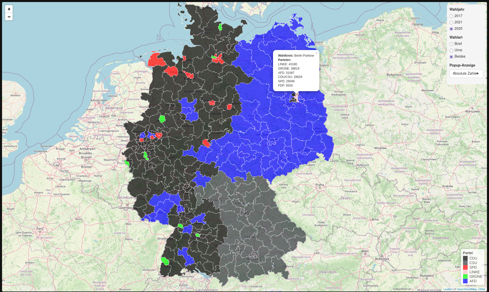

# Analyse Briefwahlen
 Projekt für das Bootcamp "Beyond Data" für die FH Wedel.

Daten wurden von [Bundeswahlleiterin](https://www.bundeswahlleiterin.de/bundestagswahlen/2025/informationen-waehler/briefwahl.html) als CSV Daten heruntergeladen und für uns passend verarbeitet.

1. **Bereinigung**
   - NA Werte werden entfernt
   - Erst-stimme wurde entfernt
   - M | D | O wurde zu männlich geändert
   - Formatierungen Standardisieren (Die Linke zu LINKE)
2. **Gruppierung**
   - Briefwähler für Land und Bund jeweils in ein Dataframe zusammengefasst
   - Nach Bundesländern und Wahlkreisen zusammengefasst
   - Verarbeitete CSV Daten gespeichert
3. **Filterung und Bearbeitung der Dataframes**
   - Ein Zentrales Dataframe aus allen anderen zusammengeführt
   - Filterfunktionen geschrieben um das Hauptdataframe dynamisch nach unseren Anforderungen zu Filtern
4. **Plots und Grafiken**
   - Aus dem gefilterten Hauptdataframe passende Diagramme und Visualisierungen erstellt
   - Torten Diagramme für Männliche/Weibliche Wahlbeteiligung
   - Säulen Diagramme für Parteiwahlergebnisse
   - Säulen Diagramme für meisten Briefwähler
5. **Interaktive Karte**
   - Server und Ui Dateien erstellt 
   - Ui: UI Elemente in der Oberen Linken Ecke erstellt
   - Server: Karte wird von Leaflet gefetched und es werden farbige Polygons basierend auf den Wahlergebnissen angewendet
   - Filterung der Karte kann durch die UI Elemente geändert werden(Absolute vs Prozentuale Zahlen)
   

   
